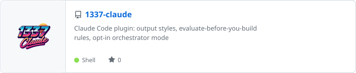

### Hi, I'm Dimitri.

I build tools for working with coding agents: a local organiser, Claude Code plugins, and the odd experiment in how an agent should talk.

#### Favourite repos

  <a href="https://github.com/dimitritholen/tasqx">
    <picture>
      <source media="(prefers-color-scheme: dark)" srcset="cards/tasqx-dark.svg">
      
    </picture>
  </a>

  <a href="https://github.com/dimitritholen/1337-claude">
    <picture>
      <source media="(prefers-color-scheme: dark)" srcset="cards/1337-claude-dark.svg">
      
    </picture>
  </a>

  <a href="https://github.com/dimitritholen/proudhuman">
    <picture>
      <source media="(prefers-color-scheme: dark)" srcset="cards/proudhuman-dark.svg">
      
    </picture>
  </a>

The cards are SVGs drawn by <a href="scripts/build_cards.py">scripts/build_cards.py</a> from each repo's README header and metadata, and refreshed nightly.
